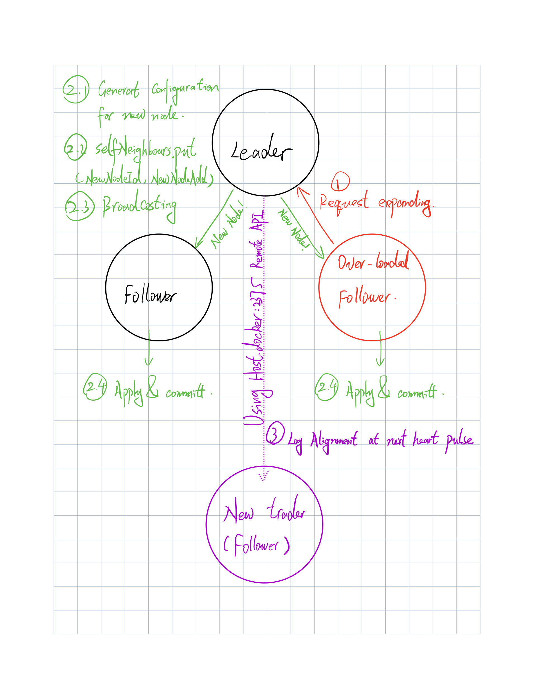
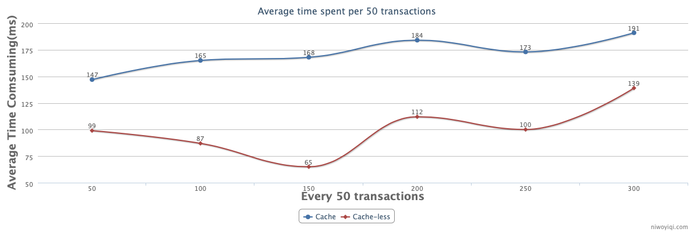
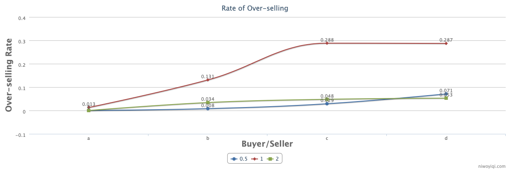

# Lab3

# Designing

## Overall designing


1. Traders are implemented as a RAFT cluster. Clients(buyers/sellers) connect to peers in the RAFT cluster to launch a transaction
2. The seller sends a transaction with a purchase number smaller than 0 to restock. (-(-x) == +x)
3. The Raft mechanism ensures that the cluster will always have a leader.
4. Leaders send regular heartbeat messages to check member health and initiate member impeachment or member addition processes if a member dies or the workload becomes too heavy.（implemented by controlling the 2375 remote operation port of the docker server）.

## Optional Extra Credit Question Designing



## Experiments

1. Comparing throughput of the cache-less and cache-based approaches.

   

   As shown above, the throughput is estimated in terms of time consumed per 50 transactions (the higher the time consumed, the lower the throughput).

   Since the cache-based approach is implemented based on a strong consistency algorithm, the throughput is lower than expected, but it maintains a very low over-selling rate in the next experiments.

2. Over-selling rates

   

   As shown above, we make over-selling rate statistics with Buyer/Seller of 0.5,1 and 1.5 respectively.

   The cache-based methods perform very well, and in some cases exceed the performance of the cacheless methods. In some cases, the no-cache approach based on mutually exclusive access will drop some seller replenishment requests in case of conflicts.

   However, the cached approach achieves a more desirable result due to the use of a strong consistency algorithm that allows each transaction to be ordered and guaranteed to execute according to a logical clock.

3.  Throughput of your system after a trader fails

a. Since in the Raft algorithm, consensus node (Trader) withdrawal sometimes sets out to re-elect the leader (the fail node is the leader). At this point the average length of the transaction fluctuates considerably.

```shell
2022-12-16 22:44:26 2022.12.17 03:44:26 UTC Timer-2 INFO  [Timer-2] c.z.c.b.t.LaunchMarket.mockResult(180): - 
2022-12-16 22:44:26 *************************************************************************************
2022-12-16 22:44:26 
2022-12-16 22:44:26 Successfully received from cs677.lab2.peer3.example.com
2022-12-16 22:44:26  transaction time=345ms
2022-12-16 22:44:26 Average time=216ms
2022-12-16 22:44:26  details: MarketTransaction{revision='null', transactionId='4c9fcbcb-5179-4754-8848-7c1a3907c38b', buyer=0c9bf5e0-16f5-48ee-b879-e0f85635a6a3, seller=null, product=1:Salt, number=87, successful=true, remark='Salt', stock=null, eventId=e6187eba-f14e-4412-861f-e0a4a4bffcf8, localTimeStamp=1671248666728, buyerAdd={domain='cs677.lab2.peer5.example.com.log', port=2021}}
2022-12-16 22:44:26 2022.12.17 03:44:26 UTC Timer-2 INFO  [Timer-2] c.z.c.b.t.LaunchMarket.mockResult(121): - Start to send purchase request to trader: cs677.lab2.peer6.example.com
2022-12-16 22:44:26 2022.12.17 03:44:26 UTC Timer-2 INFO  [Timer-2] c.z.c.b.t.LaunchMarket.mockResult(155): - 
2022-12-16 22:44:26 *************************************************************************************
```

b. In the case where the exiting node is not the leader, it is only necessary for the leader to broadcast a message when a node failure is detected, causing all nodes in the cluster to commit and perform a "delete neighbor" operation (equivalent to adding a new transaction). So it does not affect the average response time too much.

```shell
2022-12-16 22:44:25 2022.12.17 03:44:25 UTC Timer-2 INFO  [Timer-2] c.z.c.b.t.LaunchMarket.mockResult(180): - 
2022-12-16 22:44:25 *************************************************************************************
2022-12-16 22:44:25 
2022-12-16 22:44:25 Successfully received from cs677.lab2.peer3.example.com
2022-12-16 22:44:25  transaction time=114ms
2022-12-16 22:44:25 Average time=158ms
2022-12-16 22:44:25  details: MarketTransaction{revision='null', transactionId='2e77898b-753d-40b3-a8ff-c2e99828a51b', buyer=0c9bf5e0-16f5-48ee-b879-e0f85635a6a3, seller=null, product=1:Salt, number=59, successful=true, remark='Salt', stock=null, eventId=bc74a67c-b4f5-444e-9edb-b172f95219fa, localTimeStamp=1671248665276, buyerAdd={domain='cs677.lab2.peer5.example.com.log', port=2021}}
2022-12-16 22:44:25 2022.12.17 03:44:25 UTC Timer-2 INFO  [Timer-2] c.z.c.b.t.LaunchMarket.mockResult(121): - Start to send purchase request to trader: cs677.lab2.peer6.example.com
2022-12-16 22:44:25 2022.12.17 03:44:25 UTC Timer-2 INFO  [Timer-2] c.z.c.b.t.LaunchMarket.mockResult(155): - 
2022-12-16 22:44:25 *************************************************************************************
```

## How to Run

1. Adjust the config file (config.yml).

   ```yaml
   # configs of the market
   traderNumber: 3
   sellerNumber: 3
   buyerNumber: 3
   port: 2121
   deployOnSingleComputer: false
   sleepBeforeStart: 30000
   numberOfTests: 20
   
   
   maxmumStok: 100
   productNameList:
     - Fish
     - Salt
     - Boar
   
   
   
   # config of runner
   rpcBuffSize: 10240
   runMode: 0 #0-cache-mode, 1-none-cache-mode
   
   # not use any more
   neighbourNum: 1
   maxJump: 5
   ```


2. cd to the test dir.

   ```shell
   cd ${APPROOT}/src/testAuto
   ```

3. Run start script.

   ```shell
   sh runDocker.sh
   ```

4. Stop & Clean.

   ```shell
   docker-compose down & sh clear.sh
   ```

   

